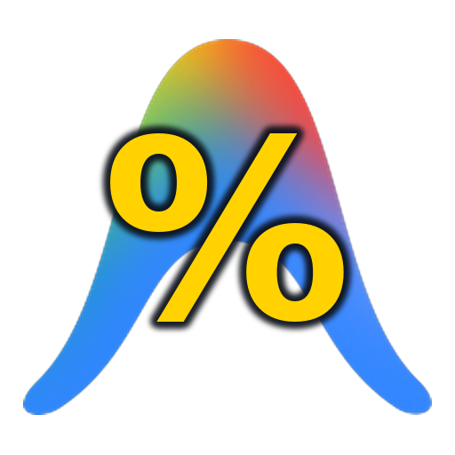

# Antigravity Quota Monitor for Linux

[](LICENSE)
[](https://kernel.org)
[](https://www.python.org/)
[]()

<div align="center">
  
  <p><em>A native-feeling standalone Linux desktop webapp and rich terminal CLI for tracking real-time 5-hour rolling sprint quotas and weekly capacity limits across multiple Google Antigravity accounts.</em></p>
</div>

---

## 💡 Why This Exists

**Google Antigravity 2.0** enforces an opaque dual-quota system:
1. **5-Hour Rolling Limit ("Sprint Quota")**: Absorbs intensive multi-turn coding and agent loops, replenishing over a rolling 5-hour window.
2. **Weekly Baseline Cap**: Restricts total compute effort over a 7-day period based on your plan tier (Pro/Ultra).

In the official Antigravity IDE, these limits are buried multiple clicks deep inside `Settings > Models & Usage`, and **you can only inspect the currently logged-in account**.

**Antigravity Quota Monitor** solves this:
* **Multi-Account Dashboard**: See all of your Google accounts side-by-side with real-time percentages and reset countdowns.
* **Dual Pool Coverage**: Live tracking for both **Gemini Models** (Flash/Pro) and **Claude & GPT Models** (Sonnet/Opus/GPT-OSS).
* **Standalone Desktop WebApp**: Runs as an independent window with **zero browser chrome** (no address bar, no tabs, no clutter), native dock icons, and single-instance window focusing.
* **Rich Terminal CLI**: For command-line power users, run `antigravity-quota status` or `antigravity-quota watch` directly in your terminal/tmux.
* **100% Private & Open Source**: Pure Python and vanilla JS. No closed-source helper binaries, no analytics, and credentials are saved locally with restricted POSIX permissions (`0600`).

---

## ✨ Features

- ⚡ **Auto-Discovery**: Automatically links to your active local Antigravity 2.0 session on startup.
- 🔄 **In-App Google OAuth**: Click **"+ Add Account"** in the app to authenticate additional accounts with one-time browser login.
- 🎯 **Single-Instance Focusing**: Clicking your desktop icon or running `antigravity-quota` while the app is open brings your existing window to the front via `wmctrl` instead of opening duplicate processes.
- ✏️ **Session Renaming**: Rename any account (e.g., *"Work"*, *"Personal"*, *"Secondary"*) right from the UI with inline editing.
- 🖥️ **Ultra-Low Resource Footprint**: The background daemon consumes less than **30 MB RAM**, starting and stopping cleanly with the app.

---

## 📦 Requirements

- **Linux Distribution**: Ubuntu, Linux Mint, Debian, Arch Linux, Fedora, etc.
- **Python 3.10+**
- **Chromium-based browser**: `chromium`, `google-chrome`, or `brave-browser`
- **wmctrl**: Standard Linux window management utility

---

## 🚀 Quick Start & Installation

Clone the repository and run the automated installer:

```bash
git clone https://github.com/mailinglistenator/antigravity-quota-linux.git
cd antigravity-quota-linux
./install.sh
```

The installer will:
1. Check system prerequisites.
2. Create an isolated virtual environment in `~/.local/share/antigravity-quota-app/.venv`.
3. Install the launcher to `~/.local/bin/antigravity-quota`.
4. Register the desktop entry (`antigravity-quota.desktop`) and high-res icon in your Linux application menu.

---

## 🖥️ Usage

### 1. Launch Desktop WebApp
You can open the app at any time via:
* **Application Menu / Search**: Press Super/Windows key and type **"Antigravity Quota"**.
* **Terminal**:
  ```bash
  antigravity-quota
  ```

### 2. Terminal CLI Commands
Prefer the terminal? The launcher doubles as a full-featured CLI:

```bash
# Print current quota table for all accounts
antigravity-quota status

# Live-updating terminal dashboard (default: updates every 30s)
antigravity-quota watch --interval 15

# List all registered accounts
antigravity-quota list

# Add an account via CLI
antigravity-quota add-account --name "Work"

# Rename an account
antigravity-quota rename "my-account@gmail.com" "Main Dev"

# Remove an account
antigravity-quota remove "Work"
```

---

## 🔒 Security & Privacy

* **Token Storage**: Account tokens are stored strictly on your local filesystem at `~/.config/antigravity-monitor/accounts.json`.
* **File Permissions**: Files are created with POSIX `0600` permissions (read/write only by your Linux user).
* **Zero Telemetry**: All network requests communicate directly between your machine and Google's OAuth / Cloud Code services (`cloudcode-pa.googleapis.com`). No telemetry or third-party servers are involved.

---

## 🗑️ Uninstallation

To completely remove the app, desktop entries, and launchers:

```bash
cd antigravity-quota-linux
./uninstall.sh
```

---

## 📄 License

Distributed under the [MIT License](LICENSE).
